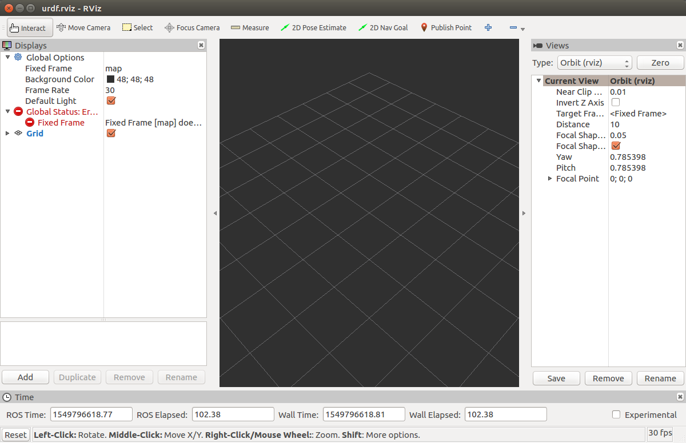
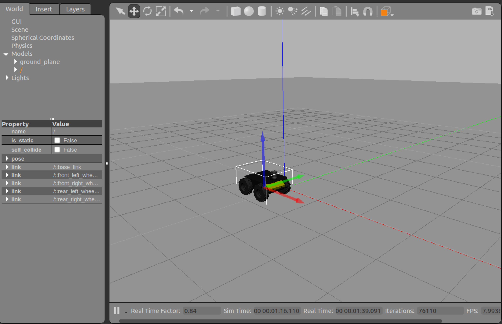
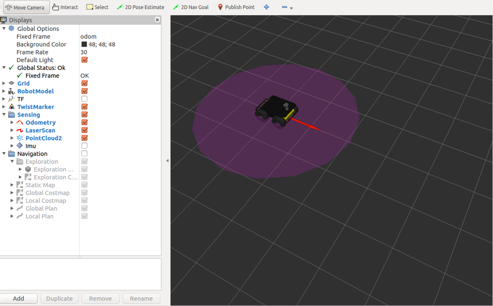

# Sensor Integration

In this session, we look into modeling simulated robots and integrate
sensors like LiDAR and Inertial Measurement Unit (IMU) to make a mobile-robot
move from one place to another.

## 3D Modelling and Simulation

Simulation and visualisations of sensors with a virtual model of our robot helps
us to test various techniques for achieving different robot behaviours.

### URDF

Unified Robot Description Format (URDF) is an XML format that describes a robot,
its parts, its joints, dimensions, etc. For A 3D robot on ROS, for example,
[the Robonaut (NASA)](https://github.com/gkjohnson/nasa-urdf-robots), a URDF
file is associated with it.

Let's build a mobile-robot which has an arm
mounted on it with a gripper and control its movement in a simulated environment.

#### Create the robot model

In this section, we'll work with the
[robot_description package](./src/robot_description) in this repository.
Please go through the URDF file `robot.urdf` in
[its urdf directory](./src/robot_description/urdf) which describes our robot.

Check whether the model is complete, and the list of components using the below
commands.

```sh
cd src/robot_description/urdf
check_urdf robot.urdf
```

We see few parent and children links as a result.

#### Launch the robot simulation

For launching a simulation of an URDF modeled-robot, we require a few
packages to be built as dependencies:

* urdf_tutorial : `rosdep install urdf_tutorial`
* robot_state_publisher : `rosdep install robot_state_publisher`
* joint_state_publisher : `rosdep install joint_state_publisher`

We'll come back to the nodes `joint_state_publisher` and `robot_state_publisher`
soon. For now, let's launch the simulation by doing the following:

* Create a ROS-launch file named `display.launch` in the launch/ directory of
robot_description. Populate it with the following contents.

```XML
<?xml version="1.0"?>
<launch>
	<arg name="model" />
	<arg name="gui" default="False" />
	<param name="robot_description" command="$(find xacro)/xacro --inorder $(arg model)" />
	<param name="use_gui" value="$(arg gui)"/>
	<node name="joint_state_publisher" pkg="joint_state_publisher" type="joint_state_publisher" />
	<node name="robot_state_publisher" pkg="robot_state_publisher" type="robot_state_publisher" />
	<node name="rviz" pkg="rviz" type="rviz" args="-d $(find urdf_tutorial)/urdf.rviz" />
</launch>
```

* Build the robot_description package using `catkin_make`, which will make it
a ROS-package. From sensor-integration directory run the following:
    * `catkin_make --pkg robot_description`

* Source the development package path, to ensure robot_description package is
discoverable in your shell environment (e.g. callable while using `rospack` command).
    * `source devel/setup.bash` (or `source devel/setup.zsh` if you're using zsh shell)

* Launch the modelled-robot through the `display.launch` and `robot.urdf` files that we just created.

```bash
roslaunch robot_description display.launch model:=`rospack find robot_description`/urdf/robot.urdf use_gui:=true
```

Above command should launch an Rviz window, something similar to the image shown
below:



Rviz by default sets the Fixed Frame to `map` frame. Please change it to
`base_link` frame and add `RobotModel` display via the "Add" button.


##### Brief description of URDF file

We breakdown the parts of robot.urdf briefly in this section.

* `<link>` element : Describes a rigid body with an inertia, visual features,
and collision properties.

In the below snippet, we describe the base of the
robot `base_link` which has a box-geometry with visual attributes like its color.

```XML
<link name="base_link">
	<visual>
		<geometry>
			<box size="0.2 .3 .1"/>
		</geometry>
		<origin rpy="0 0 0" xyz="0 0 0.05"/>
		<material name="white">
			<color rgba="1 1 1 1"/>
		</material>
	</visual>
</link>
```

* `<joint>` element : Describes the kinematics and dynamics of a joint between
two _links_, along with its safety limits.

Below _joint_ description provides details on how the *base_link* and *wheel_1*
links are connected. Take note of the joint type `fixed`, which means *wheel_1*
has a fixed connection with *base_link*, with all degrees-of-freedom locked.

 ```XML
<joint name="base_to_wheel1" type="fixed">
	<parent link="base_link"/>
	<child link="wheel_1"/>
	<origin xyz="0 0 0"/>
</joint>
 ```

For more information on the XML tags of URDF file, please refer to its
documentation [here](http://wiki.ros.org/urdf/XML).


#### Exercise: Missing URDF Components

You might have noticed a missing component in the robot-model shown on Rviz.
Complete the model in the URDF file to add the missing component. And relaunch
`display.launch` file using the section above:
[Launch the robot simulation](#launch-the-robot-simulation).

Look for the solution below in case you can't complete the model.

<details>
<summary>Solution: Missing URDF components</summary>
<br>

A link for wheel-4.<br>

```
<link name="wheel_4">
	<visual>
  	<geometry>
			<cylinder length="0.05" radius="0.05"/>
		</geometry>
		<origin rpy="0 1.5 0" xyz="-0.1 -0.1 0"/>
		<material name="black"/>
	</visual>
</link>
```

<br><br>
A joint connecting wheel-4 to the robot's base-link.<br>

```
<joint name="base_to_wheel4" type="fixed">
	<parent link="base_link"/>
	<child link="wheel_4"/>
	<origin xyz="0 0 0"/>
</joint>
```
</details>


#### Adding collision and inertial properties

We finish our (box) robot description by adding collision and inertial properties
to its links. These properties are required when we run the simulation in an
environment supporting a physics engine e.g. Gazebo.

Complete description of the robot could be found in `robot1.urdf` in urdf/
directory.

Notes:
* Notice the `<collision>` and `<inertial>` tags for each `<link>` element in
robot1.urdf.
* Take note of `robot1.xacro` in urdf/ directory. Xacro formats provide an efficient
way to reduce the size and complexity of URDF files by [using constants, simple math
expressions, and macros](http://wiki.ros.org/urdf/Tutorials/Using%20Xacro%20to%20Clean%20Up%20a%20URDF%20File).

For more details on collision and inertial properties, go through their [docs](http://wiki.ros.org/urdf/Tutorials/Adding%20Physical%20and%20Collision%20Properties%20to%20a%20URDF%20Model).


#### Details on simulating modelled robots

Earlier we used two packages in our launch file to spin up our modelled-robot:
[joint_state_publisher](http://wiki.ros.org/joint_state_publisher) and
[robot_state_publisher](http://wiki.ros.org/robot_state_publisher).
Few notes on these packages below:

* joint_state_publisher : Publishes a robot joints' state information (position
and velocity), as read from its URDF file. Topic that it publishes on : `/joint_states`.

* robot_state_publisher : Broadcasts the state of the robot to the
[TF transform](http://wiki.ros.org/tf2) library. Listens on `/joint_states` topic
and continuously publishes the relative transforms between the joints on TF, using
its internal kinematics map that tracks the joints with respect to one another.


## Sensor Integration

In this section, we'll work with the simulated model of [Clearpath Husky](https://www.clearpathrobotics.com/husky-unmanned-ground-vehicle-robot/).
We will first launch it in Gazebo, which will provide us the environment that the
robot will interact with and then we'll control its movements.

### Gazebo Simulation

#### Dependencies

`husky_simulator` and `husky_viz` are the packages that we'll be working with.
Install these dependencies using below commands.

```sh
sudo apt install ros-kinetic-husky-simulator
sudo apt install ros-kinetic-husky-viz
```

#### Running Husky in Gazebo

```sh
roslaunch husky_gazebo husky_empty_world.launch  # Launches Husky with SICK LiDAR and and IMU, in an empty world within Gazebo.
roslaunch husky_viz view_robot.launch  # Launches the Rviz window showing Husky model and the measurements received by its LiDAR sensor.
```

You should be able to see Gazebo and Rviz windows as shown below.





Experiment with adding objects (e.g. a box) on Gazebo and view its LiDAR scan
lines on Rviz.

#### Exercise: Viewing TF tree and topics map

It is (always) recommended to view the TF tree and the map of topics that are
active. Make use of `tf` and `rqt_graph` package's commands to view this
information.

<details>
<summary>Solution: Viewing TF tree and topic </summary>
<br>
Run view_frames node.
<br>
```
rosrun tf view_frames
```
<br><br>
View the generated TF tree.
<br>
```
evince frames.pdf
```
<br><br>
Run rqt_graph node to view the topics.
<br>
```
rosrun rqt_graph rqt_graph
```
</details>

### Controlling Husky

From the above exercise on viewing topics' map, you might have noticed that Husky
simulation has a `/husky_velocity_controller/cmd_vel` namespace topic published
by `/twist_mux` node and subscribed by `gazebo` node. We will make use of this
topic to publish `geometry_msgs/Twist` messages to make Husky move.

```sh
rostopic pub -r 10 /husky_velocity_controller/cmd_vel geometry_msgs/Twist  '{linear:  {x: 0.1, y: 0.0, z: 0.0}, angular: {x: 0.0,y: 0.0,z: 0.0}}'
```

#### Exercise: Making Husky move in circles

In this exercise you'll write a ROS node that commands the simulated Husky to
move in a circular path. Make use of [husky_controller](src/husky_controller)
package in this repository. Complete the `circle_driver.cpp` file to publish appropriate
messages to `/husky_velocity_controller/cmd_vel` topic. Make sure to compile and
source the `devel/setup.bash` directory for your node to be included in the _path_.

You are welcome to write the `circle_driver` node in Python.

<details>
<summary> Solution: Making Husky move in circles </summary>
<br>
Find a sample way to achieve this task in
[circle_driver_solution.md](./resources/solution/circle_driver_solution.md)

</details>

### Stretch Goal : Stopping Husky in front of an object

1. Add an object on Gazebo like a box in front of Husky so that Husky stops when
it is less than 5 metres away from the box.

  * Make use of the logic in `circle_driver` above that publishes commands to
  Husky's `/husky_velocity_controller/cmd_vel` topic.

  * A ROS node that subscribes to LiDAR scans, observes the distance from an
  object, and sends commands similar to `circle_driver` node.

2. Find a way to integrate Kinect camera onto the simulated Husky. Going through
its [source](https://github.com/husky/husky.git) might give you few pointers.

### References

1. URDF XML Specification: http://wiki.ros.org/urdf/XML
2. Collision and Inertial properties: (http://wiki.ros.org/urdf/Tutorials/Adding%20Physical%20and%20Collision%20Properties%20to%20a%20URDF%20Model
3. Xacro file format: http://wiki.ros.org/urdf/Tutorials/Using%20Xacro%20to%20Clean%20Up%20a%20URDF%20File
