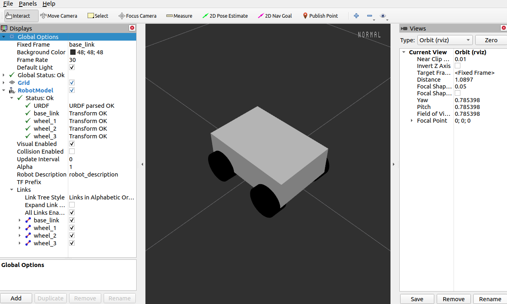

# Sensor Integration

In this session, we look into modeling simulated robots and integrate
sensors like LiDAR and Inertial Measurement Unit (IMU) to make a mobile-robot
move from one place to another.

## 3D Modelling and Simulation

Simulation and visualisations of sensors with a virtual model of our robot helps
us to test various techniques for achieving different robot behaviours.

### URDF

Unified Robot Description Format (URDF) is an XML format that describes a robot,
its parts, its joints, dimensions, and so on. A 3D robot on
ROS, for example, [the Robonaut (NASA)](https://github.com/gkjohnson/nasa-urdf-robots),
a URDF file is associated with it. Let's build a mobile-robot which has an arm
mounted on it with a gripper and control it in the simulated environment.

#### Create the robot model

Let's create a mobile robot model which we'll command to move. Please go through
the URDF file `robot.urdf` in the urdf/ directory of robot_description folder.

Check whether model is complete, and the list of components using:
```
check_urdf robot.urdf
```

#### Launch the robot simulation

For launching a simulation of an URDF modeled-robot, we require a few
packages to be built as dependencies:

* urdf_tutorial : `rospack install urdf_tutorial`
* robot_state_publisher : `rospack install robot_state_publisher`
* joint_state_publisher : `rospack install joint_state_publisher`

We'll come back to the nodes `joint_state_publisher` and `robot_state_publisher`
soon. For now, let's launch the simulation by doing the following:

* Create a ROS-launch file named `display.launch` in the launch/ directory of the
robot_description. Populate it with the following contents.

```
<?xml version="1.0"?>
<launch>
	<arg name="model" />
	<arg name="gui" default="False" />
	<param name="robot_description" command="$(find xacro)/xacro --inorder $(arg model)" />
	<param name="use_gui" value="$(arg gui)"/>
	<node name="joint_state_publisher" pkg="joint_state_publisher" type="joint_state_publisher" />
	<node name="robot_state_publisher" pkg="robot_state_publisher" type="robot_state_publisher" />
	<node name="rviz" pkg="rviz" type="rviz" args="-d $(find urdf_tutorial)/urdf.rviz" />
</launch>
```

* Build the robot_description directory using `catkin_make`, which will make it
a ROS-package. From sensor-integration parent directory run the following:
    * `catkin_make --pkg robot_description`

* Source the development package path, to ensure robot_description package is
discoverable in your shell environment (e.g. callable while using `rospack` command).
    * `source devel/setup.bash` (or `source deve/setup.zsh` if you're using zsh shell)

* Launch the modeled-robot through the `display.launch` and `robot.urdf` files that we just created.
```bash
roslaunch robot_description display.launch model:=`rospack find robot_description`/urdf/robot.urdf use_gui:=true
```

Above command should launch an Rviz window, something similar to image shown below:



Rviz by default sets the Fixed Frame to `map` frame. Please change it to
`base_link` frame and add `RobotModel` display via the "Add" button.


#### Exercise

You might have noticed a missing component in the robot-model shown on Rviz.
Complete the model in the URDF file to add the missing component.

Look for the solution below in case you can't complete the model.

<details>
<summary>Solution: Missing URDF components</summary>
<br>

A link for wheel-4.<br>
```
<!--<link name="wheel_4">-->
    <!--<visual>-->
        <!--<geometry>-->
            <!--<cylinder length="0.05" radius="0.05"/>-->
        <!--</geometry>-->
        <!--<origin rpy="0 1.5 0" xyz="-0.1 -0.1 0"/>-->
        <!--<material name="black"/>-->
    <!--</visual>-->
<!--</link>-->
```
<br><br>
A joint connecting wheel-4 to the robot's base-link.<br>
```
<!--<joint name="base_to_wheel4" type="fixed">-->
    <!--<parent link="base_link"/>-->
    <!--<child link="wheel_4"/>-->
    <!--<origin xyz="0 0 0"/>-->
<!--</joint>-->
```
</details>


#### Details on simulating modeled robots

Earlier we saw we used two packages in our launch file to spin up our modeled-robot:
[joint_state_publisher](http://wiki.ros.org/joint_state_publisher) and
[robot_state_publisher](http://wiki.ros.org/robot_state_publisher).
Few notes on these packages below:

* joint_state_publisher : Publishes a robot joints' state information (position
and velocity), as read from its URDF file. Topic that it publishes on : `/joint_states`.

* robot_state_publisher : Broadcasts the state of the robot to the
[TF transform](http://wiki.ros.org/tf2) library. Listens on `/joint_states` topic
and continuously publishes the relative transforms between the joints on TF using
its internal kinematic map.


## Sensor Integration

### Creating transforms – TF Library

### Publishing Sensor Information

### Publishing Odometry Information

### Controlling the Robot Base

### Exercise : Robot moving in circles
